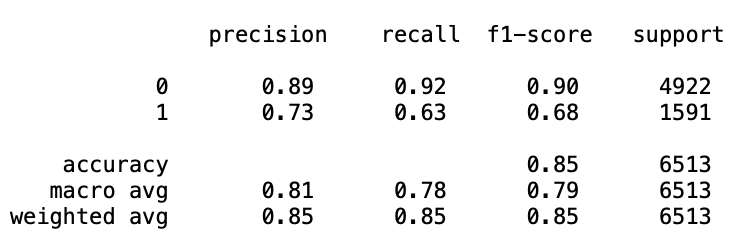
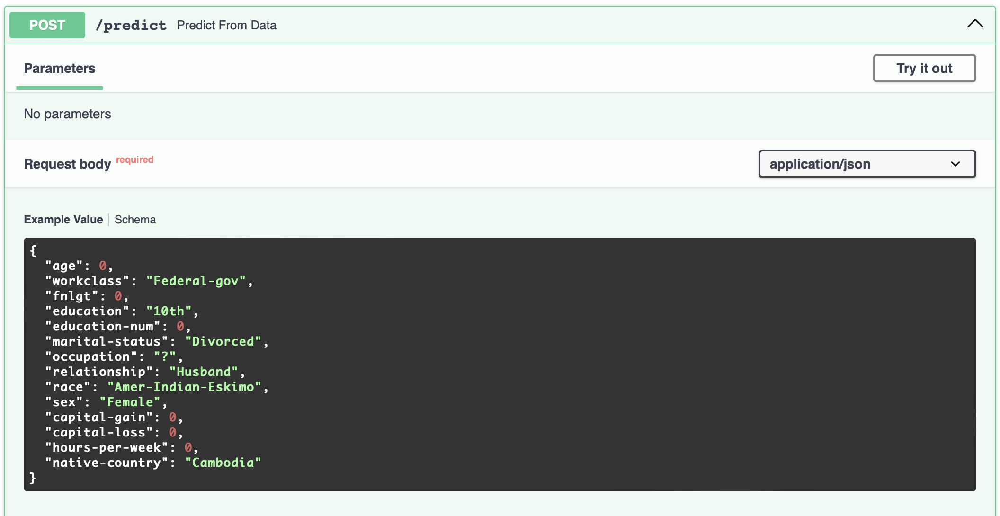
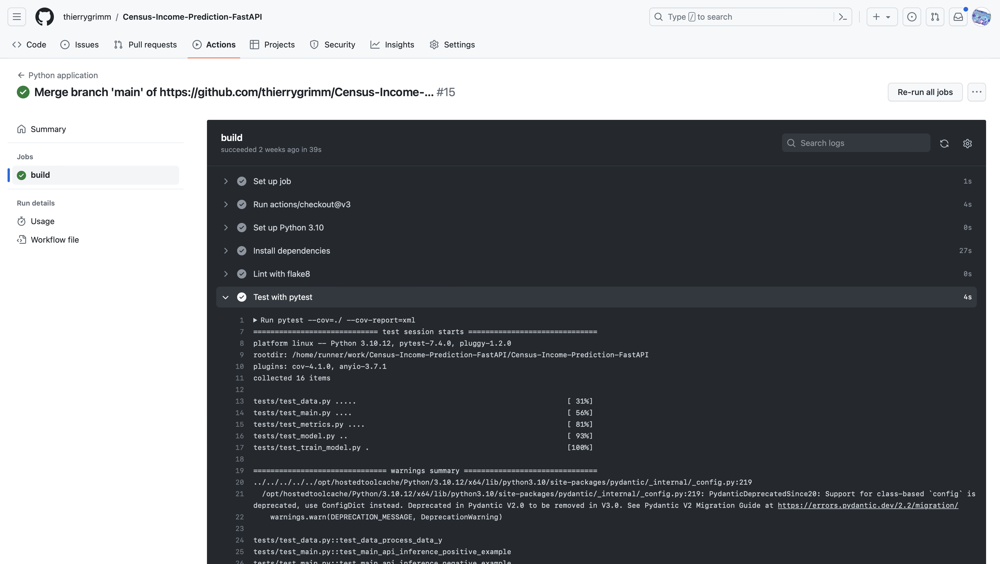

<a name="readme-top"></a>


# Census Income Prediction with FastAPI [](https://www.paypal.com/cgi-bin/webscr?cmd=_s-xclick&hosted_button_id=EFQXNQ7UYXYKW&source=url)

<details>
  <summary>Table of Contents</summary>
  <ol>
    <li>
      <a href="#project-description">Project description</a>
    </li>
    <li>
      <a href="#metrics">Metrics</a>
    </li>
    <li>
      <a href="#files-and-data-description">Files and data description</a>
    </li>
    <li>
      <a href="#getting-started">Getting Started</a>
      <ul>
        <li><a href="#requirements">Requirements</a></li>
        <li><a href="#usage">Usage</a></li>
        <li><a href="#running">Running</a></li>
        <li><a href="#querying">Querying</a></li>
      </ul>
    </li>
    <li><a href="#unit-testing">Unit Testing</a></li>
    <li><a href="#caveats-and-recommendations">Caveats and Recommendations</a></li>
    <li><a href="#acknowledgments">Acknowledgments</a></li>
    <li><a href="#issues">Issues</a></li>
    <li><a href="#license">License</a></li>
  </ol>
</details>

## Project description

This project seeks to classify individuals into high salary (>50k) and low salary (<=50k) categories.
It should mainly be used in fairness and bias-related endeavours and not in production.

The module follows coding (PEP8) and engineering best practices for implementing software (modular, documented
and tested). It is built with unit tests which also log any errors, info and warning messages to a log file. The slice
validation and the API unit tests were incorporated into a CI/CD framework using GitHub Actions. On a push it
automatically runs flake8, pytest unit tests and codecov to ensure adequate code coverage.

Data segregation was performed with a regular train-test-split with 80% used for training and 20% for testing
On the backend predictions are made using a `Random Forest` model.

To create a RESTful API that can be queried, FastAPI in combination with Pydantic for type hinting (ensuring proper
format for inputs) was used. Subsequently, the API was deployed as a web application, but the webserver is not publicly
accessible anymore.
The ```RESTful API``` has 2 different endpoints:

* (GET) at ```/``` on the root giving a welcome message
* (POST) at ```/predict``` that does model inference on the body with data in json format

## Metrics

F1 classification with a macro average of 0.79, 0.68 for the minority class, and 0.90 for the majority class.



When analyzing across data slices, model performance is higher for low-salary individuals.

## Files and data description

**File structure:**

```
.
├── Images                        # Screenshots and images                                            
├── data                          # Data
│   ├── census.csv                  # Entire dataset
│   ├── test.csv                    # Test split
│   └── train.csv                   # Train split
├── data.py                       # Data preprocessing pipeline
├── format.py                     # Type hinting for the API
├── main.py                       # FastAPI app endpoints                       
├── metrics.py                    # Generates metrics on slices of the data                    
├── model                         # Serialized model and objects
│   ├── LB.pkl                      # Label Binarizer
│   ├── OHE.pkl                     # Data OneHotEncoder
│   └── rfc_model.pkl               # Random Forest Model
├── model.py                      # Model training helper functions
├── model_card.md                 # Details on model and data               
├── query_api.py                  # Code to query the deployed API
├── * README.md                   # Project overview and instructions                    
├── requirements.txt              # Python module requirements
├── slice_output.txt              # Output of metrics.py
├── tests                         # Unit test suite
│   ├── test_data.py                # Tests data processing
│   ├── test_main.py                # Tests API
│   ├── test_metrics.py             # Tests metrics prerequisites
│   ├── test_model.py               # Tests predictions and model metrics
│   └── test_train_model.py         # Tests training prerequisites
└── train_model.py                # Model training pipeline
```

<p align="right">(<a href="#readme-top">back to top</a>)</p>

## Getting started

### Requirements

Make sure all module requirements are met or install them with:

~~~
python -m pip install -r requirements.txt
~~~

### Usage

The main code for the API can be found in ```main.py```.

### Running

To run the program execute the following command from the command line (CLI) :

~~~
uvicorn main:app --reload
~~~

By default, this will run the API on localhost on ```http://127.0.0.1:8000```. Beware if this port was already occupied
it might be deployed on a different port or not be functional. By default, there is a greeting at the root by GET:


To send sample queries and test the API you can access the Swagger UI docs from your browser under:

~~~
http://127.0.0.1:8000/docs
~~~

This will render an overview of the different API endpoints including the ```/predict``` POST endpoint:



### Querying

To query your deployed API edit the script ```query_api.py``` to include your API's host and port.


You can then query by running it in a terminal and should receive both the prediction and status code.


<p align="right">(<a href="#readme-top">back to top</a>)</p>

## Unit testing

To run a Unit test suite, in the local file directory run:

~~~
pytest -vv
~~~

To run a specific Unit test, as for example for the ```main.py``` you may run:

~~~
pytest tests/test_main.py -vv
~~~

This project makes use of GitHub actions. Upon a push to main the test suite and other components such as flake8 or
codecov will automatically be run:



<p align="right">(<a href="#readme-top">back to top</a>)</p>

## Caveats and Recommendations

This model is built on a dataset that contains sensitive attributes and (legally) protected groups such as race or sex.
Furthermore, the dataset overall is imbalanced with a higher proportion of low income individuals. For high-income
individuals the F1-score and especially the recall is worse. Also, the model performs slightly worse for women than for
men. Another limitation of the model is the necessity for complete input data. Missing values are not handled
off-the-gate.

It is recommended this model is strictly used for bias and fairness-related studies.

<p align="right">(<a href="#readme-top">back to top</a>)</p>

## Acknowledgments

* The Census Income dataset is open source and was acquired from the UCI Machine Learning Repository. It is originally
  from: Kohavi,Ron. (1996). Census Income. UCI Machine Learning Repository. https://doi.org/10.24432/C5GP7S.
* The project is part of the ML DevOps Engineer Udacity Nanodegree.

## Issues

Found a bug? Want more features? Find something missing in the documentation? Let me know! Please don't hesitate
to [file an issue](https://github.com/thierrygrimm/Census-Income-Prediction-FastAPI//issues/new) and make a
recommendation.

## License

```
Census Income Prediction FastAPI - Evaluating bias and fairness in income prediction scenarios

The MIT License (MIT)

Copyright (c) 2023 Thierry Grimm

Permission is hereby granted, free of charge, to any person obtaining a copy
of this software ("Census Income Prediction FastAPI") and associated documentation 
files (the "Software"), to deal in the Software without restriction, including without
limitation the rights to use, copy, modify, merge, publish, distribute, sublicense, 
and/or sell copies of the Software, and to permit persons to whom the Software is 
furnished to do so, subject to the following conditions:

The above copyright notice and this permission notice shall be included in
all copies or substantial portions of the Software.

THE SOFTWARE IS PROVIDED "AS IS", WITHOUT WARRANTY OF ANY KIND, EXPRESS OR
IMPLIED, INCLUDING BUT NOT LIMITED TO THE WARRANTIES OF MERCHANTABILITY,
FITNESS FOR A PARTICULAR PURPOSE AND NONINFRINGEMENT. IN NO EVENT SHALL THE
AUTHORS OR COPYRIGHT HOLDERS BE LIABLE FOR ANY CLAIM, DAMAGES OR OTHER
LIABILITY, WHETHER IN AN ACTION OF CONTRACT, TORT OR OTHERWISE, ARISING FROM,
OUT OF OR IN CONNECTION WITH THE SOFTWARE OR THE USE OR OTHER DEALINGS IN
THE SOFTWARE.
```
